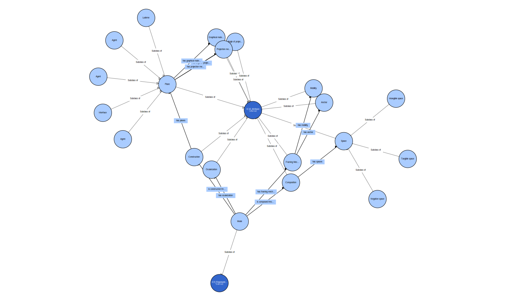

# FAVR Ontology
This is an attempt to build an ontology out of [FAVR](https://www.ludov.ca/index.php/en/observation/graphical-technologies/game-favr), the framework for the analysis of visual representation in video games. This repository also holds the exported [Tropy](https://www.tropy.org/) templates that implemented the ontology.

## Visualization

---

The FAVR was developed by

- Dominic Arsenault, Université de Montréal, dominic.arsenault@umontreal.ca
- Pierre-Marc Côté, Université de Montréal, pierre-marc.cote.1@umontreal.ca
- Audrey Larochelle, Université de Montréal, audrey.larochelle@umontreal.ca

Read the paper on the model at [https://journals.sfu.ca/loading/index.php/loading/article/view/155/190](https://journals.sfu.ca/loading/index.php/loading/article/view/155/190).

> Arsenault, Dominic, Pierre-Marc Côté and Audrey Larochelle. 2015. "The Game FAVR: A Framework for the Analysis of Visual Representation in Video Games". Loading…Journal of the Canadian Game Studies Association, vol.9, no.14, p. 88-123.

This ontology, the Tropy templates and examples are published under [CC0 1.0 Universal](LICENSE). Contact possibilities for me can be found via [thgie.ch](https://thgie.ch).