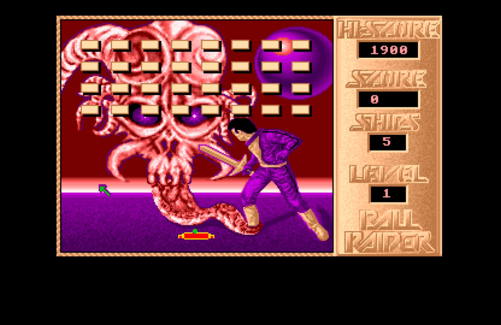

# FAVR Ontology
This is an attempt to build an ontology out of [FAVR](https://www.ludov.ca/index.php/en/observation/graphical-technologies/game-favr), the framework for the analysis of visual representation in video games. This repository also holds the exported [Tropy](https://www.tropy.org/) templates that implemented the ontology.

- [Visualization](#visualization)
- [Documentation](#documentation)
- [Tropy Templates](#tropy-templates)
- [Examples](#examples)
- [Imprint](#imprint)

## Visualization

## Documentation

Here is a brief summary of each point based on the provided articles and documents:

### Basic Elements

#### Mode
A visual mode refers to a unified visual structure on the screen that is intelligible to the player. Games often feature multiple visual modes, each occupying the screen sequentially or simultaneously, such as gameplay, menus, or title screens.

#### Composition
Composition involves analyzing the entire screen and distinguishing between different regions, such as tangible space where player interactions occur, intangible space like interfaces, and negative space, which refers to non-interactive areas.

#### Construction
Image construction in games involves the internal layering and organization of visual elements. This can include characters, in-game environments, off-game environments, and interfaces, with each element potentially using different graphical materials and projection methods.

#### Space
Space in visual composition refers to the different areas within the screen, such as tangible spaces (where player interaction is most direct), intangible spaces (interfaces and overlays), and negative spaces (non-interactive regions or ornamental areas) .

#### Plane
Planes refer to the different conceptual layers in the game’s visual representation, such as the plane of agents (characters), in-game environment, and off-game environment. Each plane can have different graphical materials and may use different projection methods and viewing angles.

### Image Composition

#### Negative Space
Negative space refers to non-interactive areas within the image, which can be blank spaces or ornamental features that do not respond to player actions.

#### Intangible Space
Intangible space includes interface elements and overlays that display game state information, decisions, or options, which are visually separate from the tangible game environment.

#### Tangible Space
Tangible space is the area where the player’s input has a direct and immediate effect on the game, such as where characters or objects react to player commands.

#### Ocularization
Ocularization refers to the representation of visual perspective or point of view in games. It can vary between internal (from within a character's eyes), external (third-person or distant view), or even multiple perspectives depending on gameplay.

#### Framing Mechanism
Framing mechanisms involve how the game’s visual field is anchored and how it moves relative to player actions. This can be subjective (tied to a character), objective (fixed viewpoint), or other configurations like mobile or anchored framing.

### Image Construction

#### Agent
The agent plane includes all characters or sprites in the game, which are entities that have the ability to act or be acted upon within the game environment.

#### Interface
The interface plane includes elements that provide feedback or information to the player, such as health bars, scores, or other HUD elements that are often overlaid on top of the game’s visual environment.

#### In-game Environment
The in-game environment refers to the interactive spaces within the game where players can move and interact with objects and other characters.

#### Off-game Environment
The off-game environment is the background or scenery that is visually present but typically non-interactive, serving more as an aesthetic or contextual layer than a functional part of gameplay.

#### Ludeme
> A ludeme is the minimal unit of play or the smallest element that can be grasped by a player, in terms of game rules or game mechanics. They're essential for gameplay and can take many forms, such as these switch-orbs-and-barrier-puzzles in The Legend of Zelda: A Link to the Past. Ludemes combines both the structural aspect of game design and the experiential aspect of player engagement, and can be composed of graphics, sounds, and game mechanics. What I'm particularly interested in is their service as an interface between playing and creating games. They reflect the dual materiality of video games: playable forms and underlying code. I see ludemes as the meeting point between player agency and the game's visual representation of its internal states. (Demleitner, 2024)

> “Nous conservons le terme de ludème parce qu’il véhicule l’idée d’élément minimal de jeu, mais  nous allons refondre sa définition. Pour nous, le ludème est la prise minimale du jouer. Dès lors, notre  définition du ludème associe des traits issus de deux plans épistémologiques (et c’est précisément  cette contraction qui permet de saisir la création comme travail particulier du goût). Le ludème est, d’une part, l’équivalent du morphème (entendu comme unité minimale articulant une forme et un sens) du jeu pensé comme langage. D’autre part, il est l’aspérité du jeu pensé comme pratique du goût. Nous résumons ici ces deux plans.

> Sur le plan épistémologique, le ludème, à l’image du morphème, se situe à un niveau intermédiaire du jeu vidéo pensé comme langage : d’une part, il est un composé d’éléments ; d’autre part, il compose des ensembles plus grands. Il est composé de graphismes, de sons et de ses mécaniques fonctionnelles en situation de jeu. Hansen (2019) propose, à ce sujet, de définir ces éléments comme étant des graphèmes, acoustèmes et mécanèmes. Dans notre perspective, néanmoins, la systématisation formelle de la proposition importe moins que la manière dont les composantes des ludèmes sont prises ensemble : le joueur prend ces propriétés ensemble et leur confère un statut d’unité. De plus, le ludème seul ne suffit pas encore à faire jeu : il est une unité de base à associer pour composer des scènes (un bloc à pousser seul n’a aucun sens ludique sans la présence – au moins – de Link et d’une porte fermée).” (Hurel, 2020, p. 197)

### Plane Properties

#### Graphical Material
Graphical materials refer to the types of graphics used within each plane, such as real-time polygons, pre-rendered backgrounds, raster graphics, or vector graphics.

#### Projection Method
The projection method refers to the technique used to represent three-dimensional objects on a two-dimensional screen, such as orthogonal, axonometric, oblique, or linear (perspective) projection.

#### Angle of Projection
The angle of projection describes the viewpoint from which the plane is presented, such as bird’s-eye view, top-down view, ¾ view, or horizontal view.

### Properties

#### has_ocularization
This property indicates whether a visual mode includes an ocularization element, defining how the game’s viewpoint is managed and presented.

#### has_framing_mechanism
This property identifies if a visual mode uses framing mechanisms to determine how the visual field is anchored or moved within the game.

#### is_composed
This indicates whether a visual mode involves a compositional structure, defining the arrangement of different spaces and elements on the screen.

#### is_constructed
This property refers to whether a visual mode includes the construction of images through different planes and layers, such as agents, environments, and interfaces.

#### has_spaces
This property denotes if the visual mode includes the concept of different spaces, such as tangible, intangible, and negative spaces.

#### has_planes
This refers to whether the visual mode uses multiple planes in its construction, including agents, in-game environments, and off-game environments.

#### has_graphical_material
This indicates if the visual mode involves specific graphical materials, such as polygons, raster graphics, or vector graphics.

#### has_projection_method
This property identifies if the visual mode includes a specific projection method for representing objects, such as orthogonal or linear projection.

#### has_angle_of_projection
This property refers to whether a visual mode uses a specific angle of projection to present the game environment, such as bird’s-eye or top-down views.

### Colors

The spaces and planes should be color-coded. This is not possible in Tropy as of yet.

- red: [Tangible Space](#tangible-space)
- orange: [Intangible Space](#intangible-space)
- dark-blue: [Negative Space](#negative-space)
- yellow: [Agents](#agent)
- green: [Interfaces](#interface)
- pink: [In-game environments](#in-game-environment)
- light-blue: [Off-game environment](#off-game-environment)
- light-purple: [Ludeme](#ludeme)

## Tropy Templates
- [FAVR Mode](tropy/FAVR%20Mode.ttp)
- [FAVR Negative Space](tropy/FAVR%20Negative%20Space.ttp)
- [FAVR Intangible Space](tropy/FAVR%20Intangible%20Space.ttp)
- [FAVR Tangible Space](tropy/FAVR%20Intangible%20Space.ttp)

## Examples
### Ball Raider (1987)

[FAVR Tropy Export as JSON-LD](examples/ball-raider-1987-main-gameplay.json)

## Imprint

Ontology developed by

- Adrian Demleitner, adrian.demleitner@hkb.bfh.ch
-  [https://orcid.org/0000-0001-9918-7300](https://orcid.org/0000-0001-9918-7300)

The FAVR was developed by

- Dominic Arsenault, dominic.arsenault@umontreal.ca
- Pierre-Marc Côté, pierre-marc.cote.1@umontreal.ca
- Audrey Larochelle, audrey.larochelle@umontreal.ca
- Sacha Lebel

Read the paper on the model at [https://journals.sfu.ca/loading/index.php/loading/article/view/155/190](https://journals.sfu.ca/loading/index.php/loading/article/view/155/190).

> Arsenault, Dominic, Pierre-Marc Côté and Audrey Larochelle. 2015. "The Game FAVR: A Framework for the Analysis of Visual Representation in Video Games". Loading…Journal of the Canadian Game Studies Association, vol.9, no.14, p. 88-123.

Consult Pierre-Yves Hurel for a contemporary discourse on the ludeme.

> Hurel, Pierre-Yves. 2020. “L’expérience de création de jeux vidéo en amateur - Travailler son goût pour l’incertitude,” May. https://orbi.uliege.be/handle/2268/247377.

## Todos

- [x] Refactor ontology to mirror developments in the FAVR framework that are described in an [unpublished paper](https://ludov.ca/documents/publications/FAVR/fr/FAVR-article.pdf). See also the the updated [flowchart](https://ludov.ca/documents/publications/FAVR/fr/FAVR-diagramme.pdf).
    - tri-planar construction became multi-planar and had *interfaces* added as a plane
    - ocularization was updated
- [x] Add ~~three~~ four conceptual planes to Tri-planar Construction: agents, interfaces, in- and off-game environment
- [x] Add sub-aspects of graphical material, projection method, and projection angle
- [x] Add sub-aspects of anchor and mobility to framing mechanism
- [ ] Add controlled vocabulary to Ocularization, Framing Mechanism (Anchor and Mobility), and Construction Planes
- [ ] Update Tropy Templates for Composition
- [ ] Add Tropy Templates for Construction

## License

This project is licensed under the GNU Affero General Public License v3.0 - see the [LICENSE](LICENSE) file for details.
